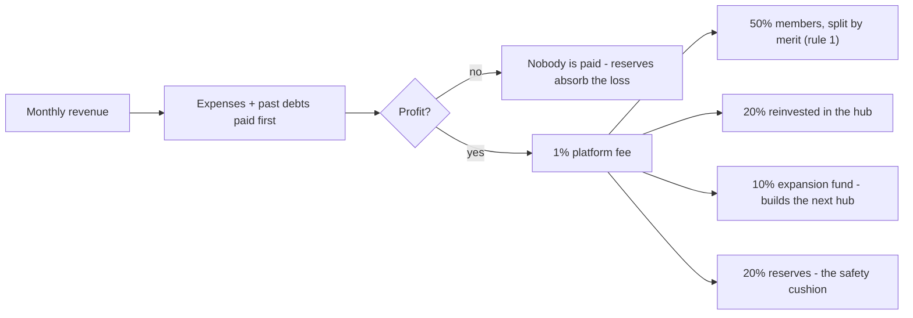
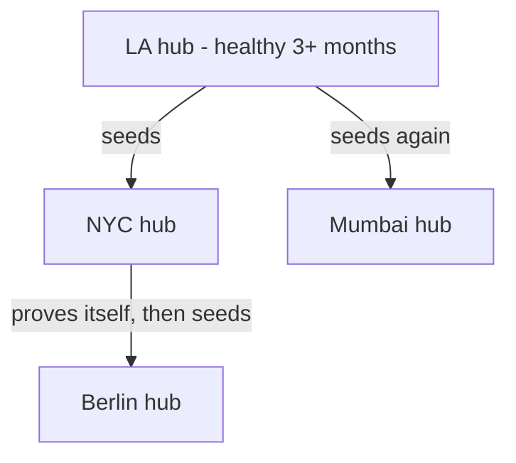

# Studio Commons

[](https://github.com/Tokeloshe/studio-commons/blob/main/LICENSE)
[](https://github.com/Tokeloshe/studio-commons/stargazers)
[](https://github.com/Tokeloshe/studio-commons/issues)

**A studio owned by the people who use it, run by rules no one can bend.**

Creative infrastructure — stages, gear, edit suites — owned as a co-op, where crediting, pay, solvency, and growth follow fixed, published rules that any member can verify. The rules are enforced by open-source software, but you can understand every one of them without reading a line of code. This page explains them.

> **Want a studio like this in your city? You don't need our permission — that's the point.**
> The step-by-step playbook: **[Founding a Hub](FOUNDING_A_HUB.md)**

---

## The whole idea in five rules

A **hub** is a creative space owned by its members, who pay modest monthly dues and share in what it earns. Five rules govern everything, and none of them requires software to understand:

**1. Work is credited by peers, not bosses.**
Every contribution — directing, editing, sound, building shelves — is logged with its hours. Its quality is scored by at least three *independent* reviewers (never yourself, never your own project's collaborators), and the **median** of their scores counts. Your merit = hours × that median. Nothing about *who you are* enters the math — no favorites in any direction, ever.

**2. Bills come first. Always.**
Nothing is "profit" until every expense of the month is paid — and if past months left debts, those are settled next. A hub that lost money pays out nothing, to anyone. This single rule is why this co-op can't die the way co-ops usually die: by distributing money it needed for rent.

**3. Payouts depend on how safe the hub is.**
The hub's health is its **runway** — how many months it could survive on reserves at current costs:

| Runway | State | What happens to profit |
|---|---|---|
| under 3 months | Critical | all of it builds reserves |
| 3–6 months | Rebuilding | half builds reserves, half is distributed |
| 6+ months | Healthy | full distribution (see rule 4) |

A struggling hub automatically saves; a safe hub automatically shares. Nobody votes on it, so nobody can be pressured over it.

**4. When healthy, profit splits four ways.**



Your share of the member half is your merit points divided by everyone's merit points. If a project earns money years later, the same ledger recomputes the same shares — residuals forever, no negotiating, no lost paperwork.

**5. Growth is earned, never gambled.**
A hub may seed a new hub in another city only when it has *proven* itself: six-plus months of runway **and** three consecutive profitable, healthy months. The seed money comes only from the expansion fund — never from reserves — and one bad month resets the clock. When several hubs qualify, the one with the longest healthy streak sponsors. The network grows exactly as fast as the model proves itself, never faster.



Each hub's finances are firewalled: a failing hub can never drain another. And every hub records who seeded it, forever.

**That's the entire system.** Everything below is detail: why these five rules kill the industry's oldest scams, how the software makes them unbreakable, and how to start a hub yourself.

---

## A month in the life of a hub

1. Money comes in: dues, stage rentals, project services. Money goes out: rent, gear, wages. Every entry is recorded as it happens.
2. Members log their work; peers review it through the month.
3. On closing day the books settle in strict order: expenses → old debts → 1% fee on what's left → the health-gated split from rule 3.
4. The month's report — revenue, costs, health state, runway, every payout — is published to all members, alongside a **conservation audit**: a check that every unit of money in equals every unit out or held. It's the meeting agenda; there's nothing to argue about because everyone can recompute it.
5. Repeat. When the runway number crosses 6 months and holds, full payouts begin. When the expansion fund can cover it, the next city gets its studio.

---

## The scams these rules kill

| The industry's version | What stops it here |
|---|---|
| **"Hollywood accounting"** — hit films that officially "lost money" so profit-sharers get nothing | Books that must balance to the unit, published every month, recomputable by any member (rule 2 + the audit) |
| **Lost credits, vanished residuals** — the person who did the work has no durable proof | A permanent, tamper-evident work ledger; year-ten revenue pays the same shares as year one (rule 1) |
| **Pay decided by politics** — who you know, who takes credit | Identity-blind math: hours × median of independent peer reviews, conflicts of interest excluded (rule 1) |
| **Owners extract everything / co-ops collapse from generosity** | Bills first, debts next, payouts gated by safety — both failure modes are structurally impossible (rules 2–3) |
| **Gatekept access** — infrastructure priced for incumbents | Cost-share membership on published, objective criteria; every hub, every city, same deal |
| **Reckless franchising / growth that never comes** | Expansion only from proven surplus, strongest hub first, firewalled finances (rule 5) |

> These end when someone in your city decides they end. **[Phase 0 of the founding guide](FOUNDING_A_HUB.md#phase-0--prove-the-demand-weeks-14-cost-0)** costs nothing and takes four weeks.

---

## Why you can trust it — and where its limits are

The rules above are enforced by the Rust code in this repo, and the enforcement is what you *don't* have to take on faith:

- **Everything is deterministic.** Same ledger, same results, byte for byte — scores, payouts, sponsor rankings, audits. Any member can recompute any decision.
- **It's adversarially tested.** Around 90 tests include a dedicated attack suite: shill reviews, review rings, double votes, hour-cap probing, rounding attacks at extreme values, ledger tampering, bleed-the-hub-dry sequences, and simulated decades of boom-and-bust checked for exact conservation after every period. Some attacks found real flaws during development; the attacks *and* the fixes are in the repo.
- **It can't be taken private.** AGPL-3.0: every deployment, including hosted ones, must publish its source.

Verify it yourself in two minutes: `git clone` this repo, then

```bash
cargo test --all
```

**And the honest limits** — a system claiming to fix trust owes you these up front:

- **Code can't see your bank account.** The audit proves the books are internally exact, not that entries match reality. Mitigation: the guide mandates monthly bank reconciliation by a rotating member, never the bookkeeper.
- **A majority of colluding reviewers beats the median.** One shill or saboteur can't move your score; an organized majority can. Small hubs should twin review pools with another hub. We made capture costly and detectable — not impossible. Nothing makes it impossible.
- **Hours are attested, not surveilled.** Caps and peer review bound the damage, but a community that tolerates inflated hours has a culture problem no ledger fixes.
- **The ledger hash isn't cryptographic yet.** Today it catches accidental corruption and casual tampering; a determined attacker with storage access could forge it. SHA-256 plus external anchoring is the designed upgrade path — until then it's a smoke detector, not a vault.
- **Code isn't law until your bylaws say so.** The founding guide's Phase 2 exists to close exactly this gap.

Found a hole not listed here? [Open an issue](https://github.com/Tokeloshe/studio-commons/issues). Breaking this system in public is a contribution.

---

## The platform fee, disclosed in full

The reference deployment sends **1% of net profit** (never revenue; loss months pay nothing) to the project's creator, to fund development: XRP wallet `rf82s1CDagppvM6ATqc1nSrL6GackzHJrm`, memo `2621443948`, verifiable via `PaymentsSystem::verify_founder_config()`.

Plainly: yes, it's a fee to the creator, and no, it isn't technically immutable — this is AGPL code and a fork can strip it in one line. We won't pretend otherwise. It's visible in source, computed by the same exact math as every other flow, and it's zero unless your hub actually profits. Keep it and you fund the commons this came from; fork it out and the license permits that. We think that trade, stated plainly, survives scrutiny.

---

## Under the hood

Each rule maps to a module; each module answers one question:

| Module | Question | Mechanism |
|---|---|---|
| `src/cci` | Who earned what? | Hash-chained work ledger; hours × median of ≥3 independent reviews; conflict-of-interest and self-review bans; hour caps |
| `src/economics` | What's safe to pay? | Costs-first waterfall, debt-before-profit, runway health states, exact integer conservation |
| `src/network` | Where does growth go? | Deterministic strongest-sponsor ranking, firewalled hub finances, seed conservation, permanent lineage |
| `src/governance` | Who decides policy? | DAO voting, hub licensing, open-access standards |
| `src/payments` | How does money move? | Multi-currency processing, platform fee |
| `src/analytics` | Is it staying fair? | Identity-blind reward-concentration (Gini) monitoring with capture warnings |
| `src/membership`, `src/compliance`, `src/treasury`, `src/utils` | Members, jurisdictions, idle funds, shared types | Portable global IDs; per-jurisdiction adapters; treasury modeling |

All money is exact integer arithmetic (no floating-point drift; rounding remainders go to reserves by design). All scoring is pure functions of the ledger.

**What's real vs. planned — so you don't discover a stub behind a claim:**
- **Working and tested now:** the entire economic rule system above — an 11-crate Rust workspace with the adversarial test suite.
- **Simulated, pending integration:** XRPL transaction submission (amounts computed and logged, not yet sent), DeFi treasury (Aave/Compound/Yearn modeled, not wired), compliance adapters.
- **Designed, not started:** member dashboard (React), Substrate governance anchoring, IPFS storage.

The economic core came first deliberately: it's the part the industry gets wrong on purpose, and it had to be provably right before anything touches real money.

## Install

Rust 1.70+ ([install](https://rustup.rs/)); Windows users see [WINDOWS_INSTALL.md](WINDOWS_INSTALL.md).

```bash
git clone https://github.com/Tokeloshe/studio-commons.git
cd studio-commons
cargo build --release
cargo test --all               # run the attack suite yourself
STUDIO_REGION=LA cargo run --release   # LA, NYC, MUMBAI, BERLIN, LAGOS, ...
```

## Roadmap

- **Done:** the economic core — merit ledger, fiscal engine, network layer — implemented and battle-tested.
- **Next:** member dashboard; XRPL + Substrate integration (real payouts, anchored ledger hashes); first pilot hub.
- **The goal:** a global network of member-owned studios where the second hub is seeded by the first one's proven surplus — and every artist in every one holds a permanent claim on the value of their work.

> The first hub in that network belongs to whoever moves first. **[Founding a Hub](FOUNDING_A_HUB.md)**

## Contributing

Same standard as the code: every feature tested, `cargo test --all` green, and any change to economic logic ships with battle tests that attack it. High-impact areas: jurisdiction adapters, the dashboard, XRPL/Substrate integration, localization. Fork → branch → tests → PR.

## License & Contact

**AGPL-3.0** — use it, modify it, deploy it; every deployment must stay open source. Community infrastructure that can't be quietly enclosed.

Creator: [@e_honiball](https://x.com/e_honiball) · [Issues](https://github.com/Tokeloshe/studio-commons/issues) · [Discussions](https://github.com/Tokeloshe/studio-commons/discussions)

---

*The industry runs on trust and breaks it for profit. Infrastructure shouldn't need trust.*

**[Found a hub](FOUNDING_A_HUB.md)** · **[Run the proof](#why-you-can-trust-it--and-where-its-limits-are)** · **[Join the discussion](https://github.com/Tokeloshe/studio-commons/discussions)**
